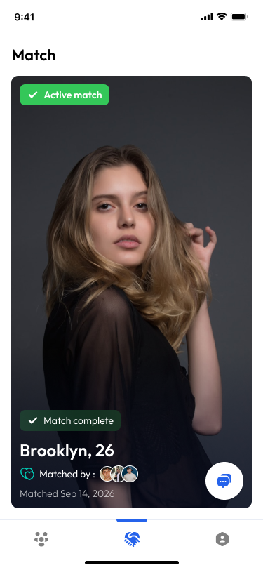

# Bridge - Awaiting Your Response

This is a pixel-perfect React Native (Expo) implementation of the "Awaiting Your Response" match screen for the Bridge application.

## 📱 Preview



## 🚀 Tech Stack

- **Framework**: [Expo](https://expo.dev/) (React Native)
- **Styling**: [NativeWind](https://www.nativewind.dev/) (Tailwind CSS)
- **Typography**: [Outfit](https://fonts.google.com/specimen/Outfit) & [Plus Jakarta Sans](https://fonts.google.com/specimen/Plus+Jakarta+Sans)
- **Icons**: Custom SVG icons (Lucide-inspired)
- **Animations**: [React Native Reanimated](https://docs.swmansion.com/react-native-reanimated/)

## ✨ Features

- **Pixel-Perfect UI**: Matches Figma design exactly, including typography, spacing, and colors.
- **Premium Aesthetics**: Glassmorphism effects, smooth gradients, and curated color palettes.
- **Backend Ready**: Clean separation of concerns with mock data that can be easily replaced by API calls.
- **Responsive Layout**: Optimized for various mobile screen sizes with proper status bar handling.

## 🛠️ Getting Started

1. **Install dependencies**:
   ```bash
   npm install
   ```

2. **Run the development server**:
   ```bash
   npm run start
   ```

3. **Open the project**:
   - Press `i` for iOS simulator
   - Press `a` for Android emulator
   - Press `w` for web browser

## 📂 Project Structure

- `src/components/matches/MatchCard.tsx`: The main card component with all the premium styling.
- `src/screens/MatchesScreen.tsx`: Container screen handling the layout and data flow.
- `src/theme/colors.ts`: Centralized color tokens.
- `src/components/Icons/Icons.tsx`: Custom SVG icons used throughout the app.

---
Created with ❤️ by Antigravity
